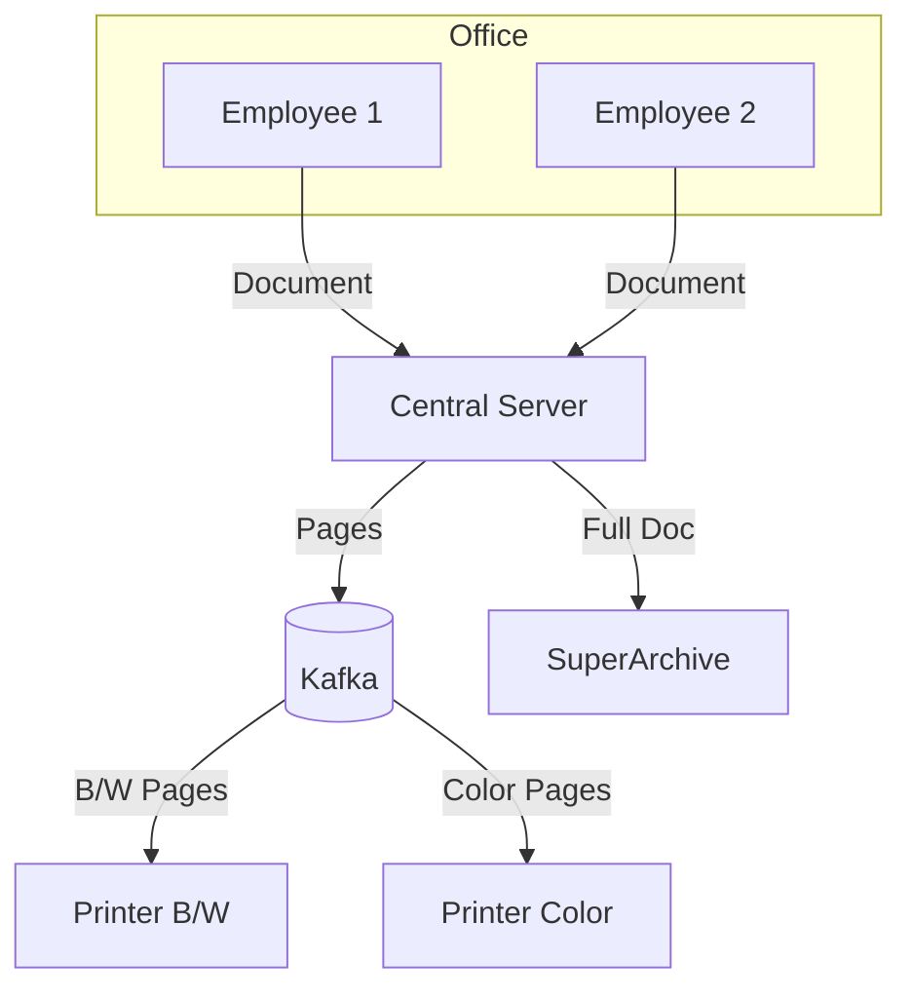

# SuperPrinter Simulation

SuperPrinter is a multi-threaded Java application that simulates a complex office printing environment using Apache Kafka as a message broker.

## Architecture

The project follows a distributed producer-consumer architecture, where different components communicate asynchronously:

1.  **Office (Main Entry Point)**: Initializes the library, starts the server, calibrates printers, and welcomes employees.
2.  **Employees (Producers)**: Each employee runs in its own thread. They "write" documents (random text from the library) and send them to the Central Server.
3.  **Server (Orchestrator)**: Receives documents from employees. It performs two asynchronous tasks:
    *   **Archiving**: Saves the full document to a "cloud" storage (simulated by `SuperArchive`).
    *   **Dispatching**: Splits the document into pages and sends each page to Kafka. It selects the appropriate Kafka topic (`black` or `color`) based on the document type. It uses the employee name as the Kafka key to ensure pages from the same document are processed in order.
4.  **Kafka (Message Broker)**: Acts as the buffer between the server and the printers.
    *   `black` topic: Handle black and white pages (3 partitions).
    *   `color` topic: Handle color pages (2 partitions).
5.  **Printers (Consumers)**: Multiple printers listen to specific Kafka topics.
    *   They poll for pages, simulate the physical printing process, and save the result as a JSON file in the `stationers_room`.

### Component Diagram



## Simulation Details

### Printing Speed
To provide a realistic simulation and allow developers to observe the process in the console, each printer has a deliberate delay.
*   **PRINTER_SLEEP_TIME_MS**: 2,000ms (2 seconds).
This delay ensures that you can see the printers "catching" pages from the wire and successfully printing them in real-time.

### Kafka Topic Cleanup
Over time, Kafka topics may accumulate many messages. We provide a utility to clean up the simulation state by deleting the topics.

#### Using the Cleanup Script
You can clean the topics using the following `make` command:

```bash
make clean-topics
```

This runs a shell script (`cleanTopics.sh`) inside the Kafka container that deletes the `black` and `color` topics.

## Getting Started

1.  **Start docker containers**: `make up`.
2.  **Start Kafka**: `make start`.
3.  **Initialize Topics**: `make init` (in a new terminal).
4.  **Check Topics**: `make check`.
5.  **Run Application**: Use your IDE to run the `Office` class.
6.  **Clean up**: `make clean-topics`.

## Postdata

I figured out that by using `CompletableFuture.runAsync(() -> {})` I could simplify the code and program workflow when it comes to some _async_ functions on the same class.

I also investigated on the best way to share the workload within a _consumer group_, and I read from different sources that the best way of doing so is by letting Kafka decide.
When sending something, is sent with the key, in this case it being the Document's title.